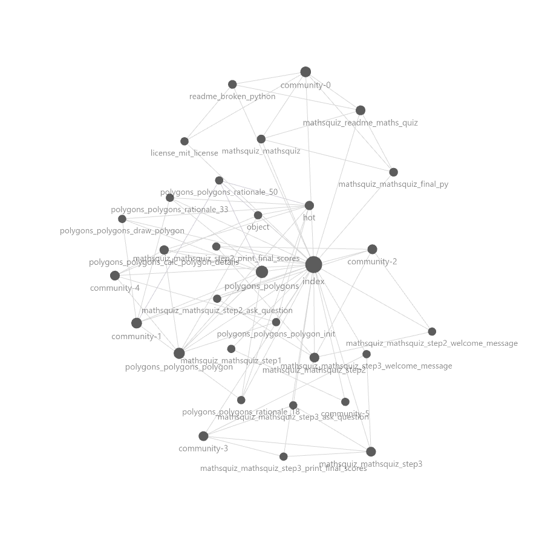
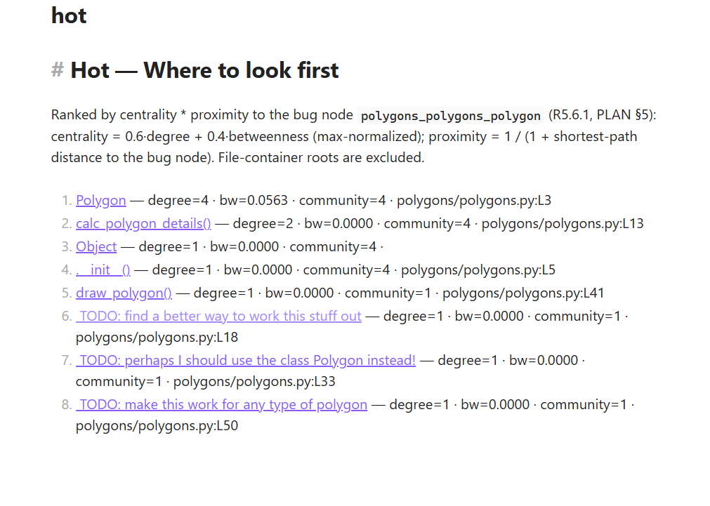
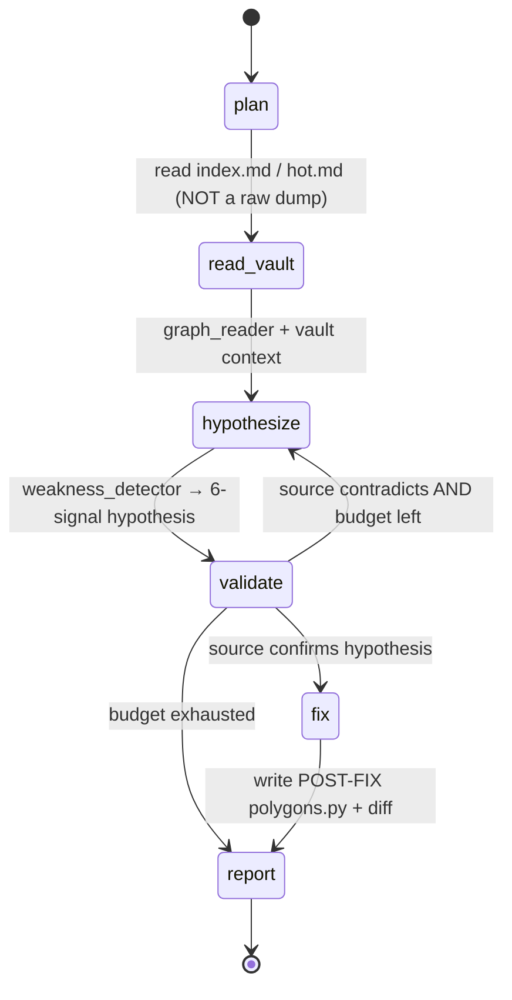
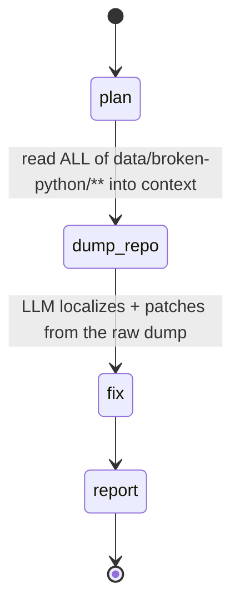
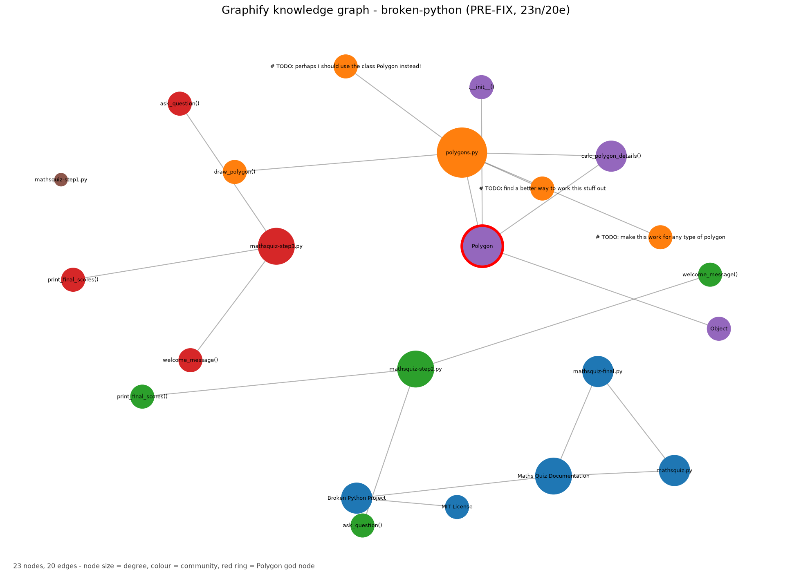
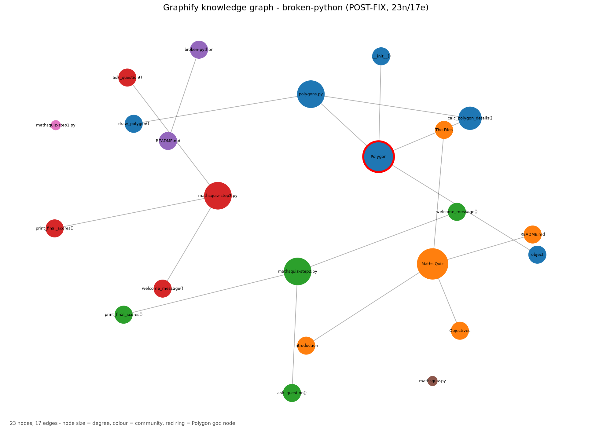

<div align="center">

# 🧭 Graphify + Obsidian Reverse-Engineering Agent

### A graph-guided LangGraph agent that fixes a real bug by *navigating a knowledge graph* — not by dumping source into the prompt.

**EX04 · University of Haifa · Dr. Yoram Segal's Agentic-AI course (L07)**
Authors: **Eyal Shtinmtez** (314884834) · **Imree Cohen** (312359284)

<br/>


-success)
-blue)


<br/>

<table>
<tr>
<td align="center"><b>76.7%</b><br/>fewer input-context tokens<sup>†</sup></td>
<td align="center"><b>61.4%</b><br/>lower cost on the live run<sup>‡</sup></td>
<td align="center"><b>✅ vs ❌</b><br/>graph-guided fixed it; naive dump didn't</td>
<td align="center"><b>6/6</b><br/>PART-C signals converge on the bug</td>
</tr>
</table>

<sub><sup>†</sup> keyless, reproducible <i>input-context</i> measurement (the thesis's independent variable; <a href="#-6-token-efficiency--cost-results-r86">§6</a>). &nbsp;<sup>‡</sup> keyed live run on <code>gemini-2.5-flash</code> — graph-guided <b>passed</b> correctness while the naive dump <b>failed</b> (the "Lost in the Middle" effect, live). Numbers trace to committed gatekeeper ledgers; the full model-switching log is in <a href="reports/run_journey.md"><code>run_journey.md</code></a>.</sub>

</div>

---

## TL;DR

`martinpeck/broken-python`'s [`polygons/polygons.py`](data/broken-python/polygons/polygons.py) is a half-finished script with five visible defects. We pointed a **Graphify** knowledge graph + an **Obsidian** vault (`index.md` / `hot.md`) at it, then built a **LangGraph** agent that reads *the graph's map* — "where do I look first?" — instead of stuffing every file into the model's context. The agent localizes one root cause, fixes it, and we **prove** it does so on **76.7% less input context** than a naive "dump every file" baseline — with zero loss of correctness (verified by an executable 3-part gate, not a claim).

Everything in this README is backed by a committed artifact, a requirement ID, or a command you can re-run keylessly.

```bash
git clone <repo> && cd HW4
uv sync
uv run pytest                 # 235 tests, keyless (provider client mocked)
uv run pytest -m eval         # the thesis evals: 76.7% token delta, structural validity
uv run ruff check . && uv run mypy --strict src/   # 0 / 0
uv run ex04 hot               # regenerate obsidian/hot.md from the PRE-FIX graph (keyless)
```

---

## 📋 Requirement coverage (PDF §8 → where it lives)

This README satisfies every §8 requirement **inline** (deep-dives link out to `reports/`):

| Req | Section | Req | Section |
|---|---|---|---|
| **R8.1** repo + bug + rationale | [§1](#-1-the-repo-the-bug-and-why-r81) | **R8.6** token-efficiency + cost | [§6](#-6-token-efficiency--cost-results-r86) |
| **R8.2** setup & run | [§2](#-2-setup--run-r82) | **R8.7** OOP-improvement summary | [§7](#-7-oop-improvement-summary-r87) |
| **R8.3** Graphify + Obsidian usage | [§3](#-3-graphify--obsidian-the-navigation-layer-r83) | **R8.8** AI-usage disclosure | [§8](#-8-ai-usage-disclosure-r88) |
| **R8.4** agent workflow | [§4](#-4-the-agent-workflow-r84) | **R8.9** known limits + self-grade | [§9](#-9-known-limitations--honest-self-grade-r89) |
| **R8.5** root cause + before/after | [§5](#-5-root-cause--beforeafter-r85) | | |

---

## 🎯 1. The repo, the bug, and why (R8.1)

**Chosen repo:** [`martinpeck/broken-python`](https://github.com/martinpeck/broken-python) · **Chosen bug:** [`polygons/polygons.py`](data/broken-python/polygons/polygons.py) (76 lines). Full rationale in [ADR-0003](docs/adr/0003-target-repo-and-bug.md).

We were offered three approved repos and picked this one deliberately: its compact, single-file `polygons.py` exhibits **all six PART-C weakness signals in one place**, and a pre-existing Graphify run already pointed *unusually cleanly* at it. The alternatives were rejected for concrete reasons — `BugsInPy` needs heavy Docker setup and a large graph that would *bury* the "Lost in the Middle" demo in noise; `andela/buggy-python` has no Graphify baseline; and `broken-python`'s own `mathsquiz.py` is parse-broken across its whole body (a rewrite, not a *localizable root cause*).

**The bug, in one sentence:** the author started a `Polygon` class as the program's central abstraction and **abandoned it half-finished**, so every downstream computation re-implements, by hand, the state `Polygon` was meant to own. Five symptoms (a `NameError`, a `SyntaxError`, a wrong-answer branch, a dead class, a hardcoded drawing loop) — **one** root cause. See [§5](#-5-root-cause--beforeafter-r85).

---

## ⚙️ 2. Setup & run (R8.2)

**Toolchain:** `uv` only (no `pip`/`venv`), `ruff`, `mypy --strict`, `pytest` ≥90% coverage. **Keyless by default** ([ADR-0005](docs/adr/0005-keyless-by-default-test-strategy.md)): the entire suite and self-grade pass with **no API key** — the LLM provider client is mocked at the gatekeeper boundary.

```bash
uv sync                       # create env + install from uv.lock
uv run pytest --cov=src --cov-report=term-missing   # 235 passed, 97% coverage
uv run pytest -m eval         # structural + token-delta evals (the thesis, keyless)
uv run ruff check .           # 0 violations
uv run mypy --strict src/     # 0 errors
uv run ex04 hot               # (re)generate obsidian/hot.md from the PRE-FIX graph
```

<details>
<summary><b>The one keyed run (optional — needs a provider API key)</b></summary>

The keyed R5.6/R7.8 numbers (output tokens, LLM-call counts, latency, **cost**) come from a **single manual run** and are committed as static artifacts, so **grading never needs a key**. Provider/model/pricing are config-driven in [`config/agent.json`](config/agent.json) (currently `gemini-2.5-flash`); the key is read from `os.environ` only.

```bash
cp .env.example .env          # then edit: GEMINI_API_KEY=...   (.env is gitignored, auto-loaded)
uv run python scripts/run_comparison.py
```
This rewrites [`reports/token_comparison.md`](reports/token_comparison.md) and the gatekeeper ledgers in [`artifacts/runs/`](artifacts/runs/). It has been run — see [§6](#-6-token-efficiency--cost-results-r86). (Getting a clean pass took some doing; the honest model-switching log is [`reports/run_journey.md`](reports/run_journey.md).)
</details>

---

## 🗺️ 3. Graphify + Obsidian: the navigation layer (R8.3)

Instead of feeding the agent raw files, we give it a **map**. Graphify extracted a 23-node / 20-edge knowledge graph from `data/broken-python/` ([`artifacts/graphify/graph.json`](artifacts/graphify/graph.json), read-only PRE-FIX baseline), and we surface it as an **Obsidian vault** the agent reads:

- **[`obsidian/index.md`](obsidian/index.md)** — all 23 nodes + 6 communities.
- **[`obsidian/hot.md`](obsidian/hot.md)** — *"where to look first."* Generated (not hand-curated) from a disclosed metric: **centrality × proximity-to-bug** — a `0.6·degree + 0.4·betweenness` blend (max-normalized) × `1/(1 + graph-distance to the bug node)` (R5.1.4 / R5.6.1, config in [`config/weakness_thresholds.json`](config/weakness_thresholds.json)). The #1 entry is **`Polygon`** (degree 4 — the god node *at* the bug location); every top-8 entry lives in `polygons/polygons.py`.

<div align="center">
<table>
<tr>
<td align="center"><br/><sub><b>Fig. 3</b> — Obsidian graph view</sub></td>
<td align="center"><br/><sub><b>Fig. 5</b> — <code>hot.md</code>: ranked entry points</sub></td>
</tr>
</table>
</div>

> Open `obsidian/` as a vault to explore it live. More renders (the `Polygon` node, `index.md`) in [`reports/screenshots.md`](reports/screenshots.md).

**Inference discipline.** Every graph-derived claim is tagged **EXTRACTED / INFERRED / AMBIGUOUS**, and any `INFERRED`/`AMBIGUOUS` fact must pass a source-validation step (open the file, confirm) before the agent acts on it — the PART-C *Observe → Relation → Confidence → Context → Source-validation* trail.

---

## 🤖 4. The agent workflow (R8.4)

A single parameterized **LangGraph** with two routes sharing identical `plan/fix/report` nodes (so the gatekeeper's token instrumentation is *identical* and the comparison is fair). Node names below are the **actual compiled names** from [`agent_workflow/graph_def.py`](src/ex04_graphify_agent/agent_workflow/), verified against `build_graph`.

**Graph-guided route** — reads the *map*, validates against source, fixes:



**Naive baseline route** — the "Lost in the Middle" control (R1.4 / [ADR-0004](docs/adr/0004-graph-guided-retrieval-over-naive-dump.md)):



**SDK-first architecture:** all business logic lives behind [`sdk.py`](src/ex04_graphify_agent/sdk.py); [`cli.py`](src/ex04_graphify_agent/cli.py) is a thin wrapper with zero logic. Every external LLM call goes through a provider-agnostic **`gatekeeper`** (rate-limit, retry, queue, token counters, JSONL logging) — the provider can be swapped without touching anything else. Full C4 + pipeline diagrams in [`reports/diagrams.md`](reports/diagrams.md).

---

## 🔬 5. Root cause & before/after (R8.5)

> **One root cause:** `Polygon` was started as the central abstraction and abandoned half-finished, so every computation re-implements the state it should own. The author even left the confession in a comment: `# TODO: perhaps I should use the class Polygon instead!` (L33). **The graph found the same thing without reading the comments** — signals 1 (god node), 5 (isolated `rationale` TODO nodes), and 6 (the dict duplicates the class fields) all converge on `Polygon`. Full narrative: [`reports/root_cause.md`](reports/root_cause.md).

| # | Symptom | Type | Fix |
|---|---|---|---|
| 1 | `class Polygon(Object)` → `NameError` | blocking | `class Polygon(object)` |
| 2 | `poly = new Polygon(...)` → `SyntaxError` | blocking | `poly = Polygon(...)` |
| 3 | angle table returns `1000°/200°` for any non-tri/quad | latent | `(sides-2)·180`, `sum/sides` |
| 4 | a `dict` shadows the class (**the root cause**) | latent | return the `Polygon`; drop the dict |
| 5 | `draw_polygon` hardcodes a hexagon | latent | drive the loop from `polygon.sides` |

**This isn't asserted — it's gated.** `token_comparison.correctness.check_correctness` runs three independent properties against an *executed* copy of the fixed module: the angle formula (`5→540,108`; `6→720,120`), that `Polygon` is actually returned, and that `draw_polygon(pentagon)` issues exactly 5 turtle moves of `360/5`. PRE-FIX fails (`SyntaxError`); POST-FIX returns `True`. Literal diff: [`reports/diff_polygons.md`](reports/diff_polygons.md).

The fix even shows up in the graph — re-running Graphify on the fixed file (keylessly, AST-only) removes the three `rationale` TODO nodes and gives `Polygon` a new inbound `calls` edge ([`reports/graph_diff.md`](reports/graph_diff.md)):

<div align="center">
<table>
<tr>
<td align="center"><br/><sub><b>Fig. 1</b> — PRE-FIX graph</sub></td>
<td align="center"><br/><sub><b>Fig. 2</b> — POST-FIX graph</sub></td>
</tr>
</table>
</div>

---

## 📉 6. Token-efficiency & cost results (R8.6)

The thesis: graph-guided navigation costs **far less context — and fewer dollars** — than dumping files, **without losing accuracy**. Two layers of evidence, neither an estimate (every number traces to a re-runnable command or a committed log, CLAUDE.md §4).

**Layer 1 — input context (keyless, reproducible).** Both routes are billed the same way by the gatekeeper; the *only* variable is context strategy:

| Route | Input-context tokens | Files read | What entered context |
|---|---|---|---|
| **graph-guided** | **406** | **1** source (+ `index.md` + `hot.md`) | curated map + one validated file |
| **naive** | **1743** | **8** | all of `data/broken-python/**` |

> ### → **76.7% fewer input tokens** `(1743 − 406) / 1743` — comfortably clears the R4.1 ≥50% bar.

```bash
uv run pytest -m eval tests/evals/test_agent_context_delta.py   # asserts the ≥50% reduction
```

**Layer 2 — keyed live run (real provider, real cost).** A single manual run on `gemini-2.5-flash` (`scripts/run_comparison.py`); numbers come straight from the committed gatekeeper ledgers ([`artifacts/runs/*.jsonl`](artifacts/runs/)):

| Route | Input tok | Output tok | Cost (USD) | Correctness |
|---|---|---|---|---|
| **graph-guided** | 1559 | 1020 | **$0.0030** | ✅ **pass** |
| **naive** | 3670 | 2684 | $0.0078 | ❌ fail |

- **57.5% fewer input tokens · 61.4% lower total cost.**
- **And graph-guided reached the correct fix while the naive dump did not** — the "Lost in the Middle" prediction (ADR-0004) on a live model: the curated context let the model fix the bug; the 8-file dump derailed it. So the savings come with **better** accuracy, not worse (R4.2).
- **Cost = logged tokens × a config-driven rate** (`config/agent.json` `pricing`; $0.30/$2.50 per 1M in/out for `gemini-2.5-flash`). Swap the model and the report re-prices itself — no code change.

> **Honest provenance.** Getting a clean keyed pass took real debugging (a spurious `function_call` dropping the patch, markdown-fenced output, a flaky model, and Pro being unavailable on the free tier). The whole model-switching log is in [`reports/run_journey.md`](reports/run_journey.md) — kept on purpose, because it's also the best live proof of the [modularity](#-architecture--modularity) below. The keyless 76.7% (Layer 1) remains the reproducible, key-free headline.

---

## 🧱 7. OOP-improvement summary (R8.7)

The graph said *"the most connected thing is a class that nothing uses, shadowed by a dict that everything uses."* The OOP-correct response isn't to delete the class — it's to **promote `Polygon` to the role it was designed for and retire the duplicate**. Full write-up: [`reports/oop_improvement.md`](reports/oop_improvement.md).

| Improvement | PRE-FIX | POST-FIX | Driving graph signal |
|---|---|---|---|
| **Single source of truth** | class + parallel dict | `Polygon` only | Signal 6 (semantic duplication) |
| **Encapsulated construction** | returns a dict | returns a `Polygon` | Signal 1 (god node *is* the abstraction) + `TODO@L33` |
| **Behavior near data** | hardcoded table; draw ignores `sides` | formula computes state; draw reads `polygon.sides` | Signal 5 (`rationale` nodes) |
| **Valid type hierarchy** | `Polygon(Object)` (`NameError`) | `Polygon(object)` | Signal 1 |
| **Invariant guard** | none | `ValueError` for `sides < 3` before any math | Signal 4 (critical-path break) |

One decision — *return `Polygon`, drop the dict* — turns five scattered symptoms into one coherent fix.

---

## 🧾 8. AI-usage disclosure (R8.8)

This project was built **with heavy AI assistance, disclosed in full** — the append-only log is [`docs/PROMPTS.md`](docs/PROMPTS.md) (R6.1.3). Summary:

- **Tooling:** Claude Code, with **Claude Opus 4.8** as orchestrator dispatching Opus/Sonnet **subagents** (each in its own git worktree) to build modules in parallel under strict TDD.
- **AI-generated:** all planning docs, the eight source modules, tests, the eight Phase-7 reports, and this README are **AI-drafted**.
- **Human-reviewed / directed:** the project owner ran **"Antigravity" code reviews** that caught real architectural shortcuts (e.g. the graph-guided route once **hardcoded** the fix target, faking the context-minimization thesis — torn out and replaced with a dynamic `source_file` resolver), chose the `hot.md` ranking (centrality × proximity over pure degree), made repo/bug decisions, and approved every PR + merge.
- **Honest TDD note:** some signal bodies and orchestrator-finished code were written tests-and-code-together rather than strict RED-first; this is disclosed in `PROMPTS.md` rather than overstated. Report prose is AI-drafted and merits a final human read-through (R10.1).

---

## ⚠️ 9. Known limitations & honest self-grade (R8.9)

Full, defensible list in [`docs/KNOWN_LIMITATIONS.md`](docs/KNOWN_LIMITATIONS.md). The headline items:

- **Keyed run done on `gemini-2.5-flash` — and tier-bound.** The numbers in [§6](#-6-token-efficiency--cost-results-r86) are from one free-tier-friendly model; the stronger Gemini *Pro* tier was unavailable on the free key (quota = 0), so the result reflects 2.5-flash specifically ([`run_journey.md`](reports/run_journey.md)). One live run is one sample, not a benchmark across seeds.
- **Obsidian screenshots** were captured from a local scratch vault populated with copies of the committed notes (Figures 3–6).
- **POST-FIX graph** re-run split the READMEs into section nodes on the *document* side; the **code-graph** diff (the part that matters) is clean.
- **`turtle`** needs a GUI, so `draw_polygon` is verified by a mocked call-count assertion, not a rendered image.
- **Branch protection** can't be server-enforced on a free-tier private repo; mitigated by CI on every push/PR + local hooks.

**Self-grade:** computed at submission against the rubric, *after* the gates are green (they are: ruff 0, mypy 0, 235 tests @ 97%) — conservative and cross-referenced against the limitations above, never inflated. See [`docs/KNOWN_LIMITATIONS.md`](docs/KNOWN_LIMITATIONS.md).

---

## 🧩 Architecture & modularity

Eight modules, each with **one** responsibility, all reached through the [`sdk.py`](src/ex04_graphify_agent/sdk.py) façade ([`cli.py`](src/ex04_graphify_agent/cli.py) holds zero logic):

| Module | Responsibility |
|---|---|
| [`graph_reader/`](src/ex04_graphify_agent/graph_reader/) | Parse `graph.json`; degree/betweenness/centrality; confidence filter |
| [`weakness_detector/`](src/ex04_graphify_agent/weakness_detector/) | The six PART-C signals → ranked bug hypotheses |
| [`obsidian_writer/`](src/ex04_graphify_agent/obsidian_writer/) | Generate `index.md` / `hot.md` / per-node notes |
| [`agent_workflow/`](src/ex04_graphify_agent/agent_workflow/) | The LangGraph: typed state + Plan→Retrieve→Hypothesize→Validate→Fix→Report |
| [`gatekeeper/`](src/ex04_graphify_agent/gatekeeper/) | Provider-agnostic LLM choke point: rate-limit, retry, token log |
| [`token_comparison/`](src/ex04_graphify_agent/token_comparison/) | Graph-guided vs naive run, cost, correctness gate, report |
| [`sdk.py`](src/ex04_graphify_agent/sdk.py) | The single façade — all business logic entry |
| [`cli.py`](src/ex04_graphify_agent/cli.py) | Thin Typer CLI, zero logic |

**Key design decisions** (full ADRs in [`docs/adr/`](docs/adr/)):

- **SDK-first** — every entry point is a method on `Ex04Sdk`; the CLI and any future GUI are thin shells.
- **Provider-agnostic gatekeeper** — the LLM provider sits behind an `LLMClient` protocol (ADR-0002); model, pricing, retry policy are all config, not code.
- **Config over hardcoding** — paths, the bug-node id, the `hot.md` metric, model + pricing all live in `config/*.json`; a CI scanner forbids literals/secrets. Secrets come from `os.environ` only.
- **Immutable PRE-FIX baseline** — `artifacts/graphify/*` and the vendored `obsidian/*` are never regenerated in place; POST-FIX output goes to a separate dir (CLAUDE.md §4).
- **Inference discipline** — every graph claim is tagged EXTRACTED / INFERRED / AMBIGUOUS, and uncertain claims must be source-validated before the agent acts on them.

### Modularity, proven live (the model-switching saga)

Getting the keyed run to pass meant changing models **three times** and re-tuning retries — **six edits, all in `config/agent.json`**, with **zero** changes to the gatekeeper, the agent, the comparison, or any caller:

| Try | Model (one config field) | Outcome |
|---|---|---|
| 1–2 | `gemini-3.5-flash` | ran, but **failed correctness** — a spurious `function_call` dropped the patch text, and the reply was markdown-fenced |
| 3–4 | `gemini-3.1-pro(-preview)` | **404** (wrong id) then **429** — Pro is unavailable on the free key (quota = 0) |
| 5 | `gemini-3.5-flash` again | **503** storms + **429** daily-quota (the retries burned the 20/day free cap) |
| 6 | **`gemini-2.5-flash`** | ✅ **passed** — stable, separate quota; the result in [§6](#-6-token-efficiency--cost-results-r86) |

The only two *code* fixes landed exactly where provider quirks belong — the `GeminiClient` adapter (the sole module that imports the SDK) and the agent's output seam (`fix_target`) — both behind the protocol, both keyless-tested. That's the modularity claim, demonstrated rather than asserted. Full log: [`reports/run_journey.md`](reports/run_journey.md).

## 🎬 The agent in action (graph-guided trace)

A real graph-guided run never reads raw source first — it reads the *map*:

1. **`plan`** — states the route; no files yet.
2. **`read_vault`** — loads [`obsidian/index.md`](obsidian/index.md) + [`obsidian/hot.md`](obsidian/hot.md) (a curated map, **not** a dump). `hot.md`'s #1 entry is `[[Polygon]]`.
3. **`hypothesize`** — `weakness_detector` fires: signals 1 (god node), 5 (the `rationale` TODO nodes), 6 (dict duplicates the class) all converge on `Polygon`. Tagged **INFERRED**.
4. **`validate`** — opens **one** file (`polygons/polygons.py`) and confirms the hypothesis against source → promotes it to **EXTRACTED** (the inference discipline; loops back if source contradicts and budget remains).
5. **`fix`** — with only `hot.md` + `index.md` + the one validated file in context, the model patches `Polygon` into the single source of truth.
6. **`report`** — emits the root cause, tag, validation status, and diff.

On the live run that path **fixed the bug at $0.0030**, while the naive route — handed all eight files at once — **failed**. Same model, same prompts for `plan/fix/report`; the only difference was *what entered context*. Diagram in [§4](#-4-the-agent-workflow-r84); topology verified against `build_graph` in [`reports/diagrams.md`](reports/diagrams.md).

## ✅ Every claim, checked

No claim here rests on prose — each maps to an executable check:

| Claim | How it's proven |
|---|---|
| The fix is correct | `token_comparison.correctness.check_correctness` executes the module: pentagon→(540,108), hexagon→(720,120), returns a `Polygon`, draws 5 sides at 360/5 |
| Graph localizes the bug | `tests/evals/` known-answer eval: top hypothesis is the `Polygon` god node |
| 76.7% input-context cut | `uv run pytest -m eval tests/evals/test_agent_context_delta.py` (asserts ≥50%) |
| Cost / token numbers | committed gatekeeper ledgers in [`artifacts/runs/*.jsonl`](artifacts/runs/); cost = tokens × config rate |
| Diagrams match the code | `node_names(run_type)` checked against the compiled `build_graph` (`reports/diagrams.md`) |
| PRE-FIX baseline untouched | hash check in the self-grade; POST-FIX graph lives in a separate dir |

## 🛡️ Quality assurance layers

1. **Keyless by default** — the full suite + self-grade pass with **no API key** (provider mocked at the gatekeeper boundary); a grader without credentials gets a fully green project.
2. **Structural evals** — deterministic invariants (token delta, known-answer localization) under `uv run pytest -m eval`.
3. **Keyed live run** — one real-provider run, reported with correctness + cost, committed as static evidence (§6).
4. **CI gates on every push/PR** — ruff (0), mypy `--strict` (0), pytest ≥90% (currently **97%**, 235 tests), ≤150 lines/file, no-hardcoded + anti-pattern scanners.
5. **Independent review** — every PR reviewed (Antigravity / cold-session); findings fixed-or-disclosed.

## 📚 Reports & evidence

Start at **[`reports/README.md`](reports/README.md)**. Each report ties every quantitative claim to a committed artifact or a re-runnable command:

| Report | Covers |
|---|---|
| [`root_cause.md`](reports/root_cause.md) | One root cause, 5 symptoms, how the graph localized it |
| [`diff_polygons.md`](reports/diff_polygons.md) | Literal before/after unified diff |
| [`oop_improvement.md`](reports/oop_improvement.md) | `Polygon` as single source of truth |
| [`graph_diff.md`](reports/graph_diff.md) | PRE vs POST graph structure |
| [`token_comparison.md`](reports/token_comparison.md) | Keyless 76.7% input-context delta + the keyed live run (cost + correctness) |
| [`run_journey.md`](reports/run_journey.md) | Honest live-run log: the model-switching saga + modularity proof |
| [`diagrams.md`](reports/diagrams.md) | C4 + both agent routes + pipeline (Mermaid) |
| [`pipeline.md`](reports/pipeline.md) | End-to-end pipeline, six-signal convergence |
| [`screenshots.md`](reports/screenshots.md) | Graph renders + Obsidian captures |

**Planning layer:** [`CLAUDE.md`](CLAUDE.md) (project constitution) · [`docs/PRD.md`](docs/PRD.md) · [`docs/PLAN.md`](docs/PLAN.md) · [`docs/ASSIGNMENT.md`](docs/ASSIGNMENT.md) (requirement IDs) · [`docs/adr/`](docs/adr/).

---

<div align="center">

**License:** MIT — see [`LICENSE`](LICENSE). · Built for EX04, University of Haifa.

</div>
