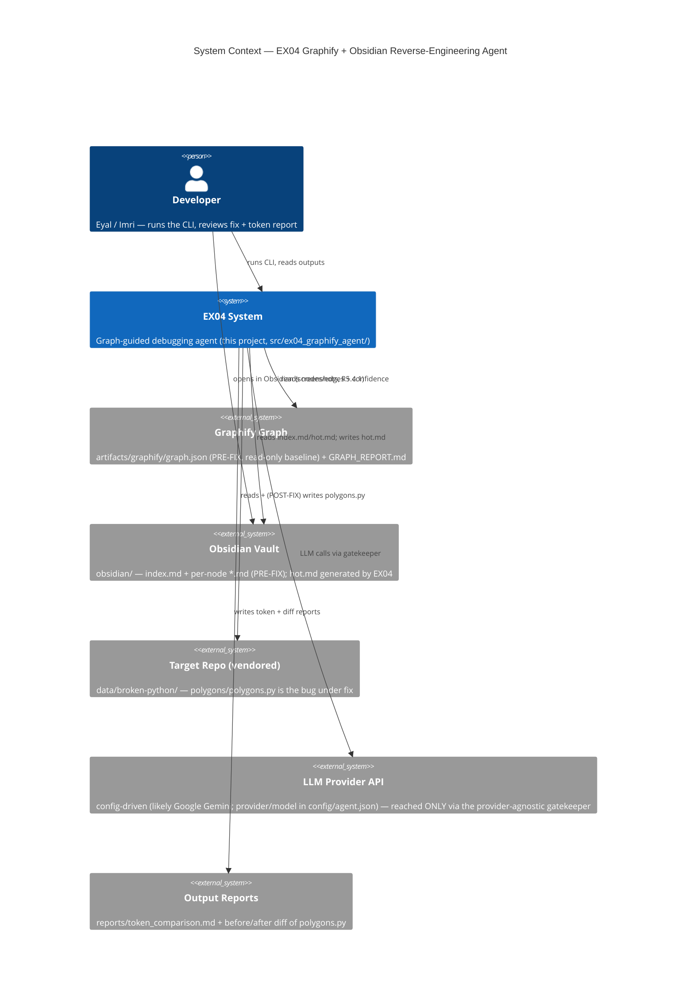
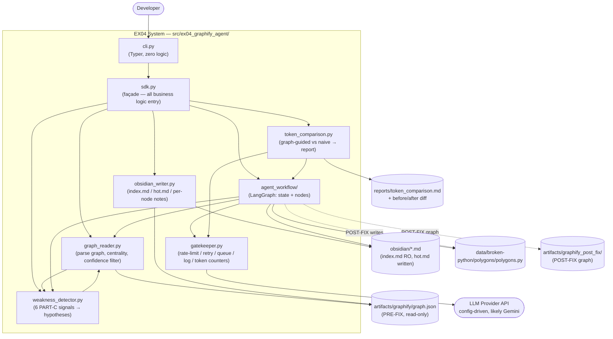
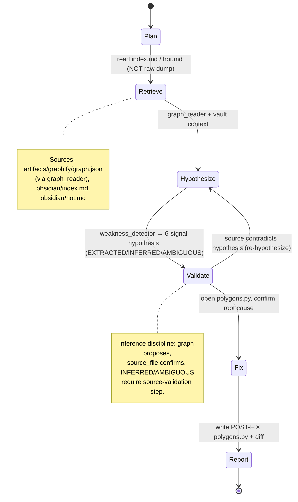
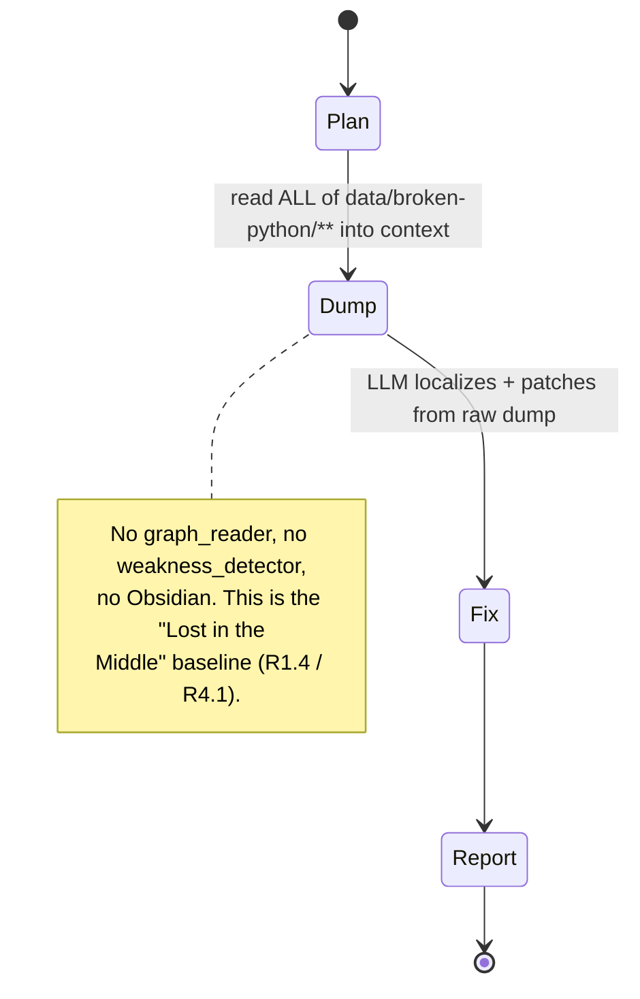

# PLAN.md — EX04: Graphify + Obsidian Reverse-Engineering Agent

> **Status:** Architecture / implementation plan. This document is the source Phase-1
> scaffolding is built FROM. Module names and structure are locked against the internal
> brief §4; ADR decisions D1–D7 are final (see `docs/adr/`).
>
> **Scope reminder:** the Graphify graph (`artifacts/graphify/graph.json`) and the PRE-FIX
> Obsidian vault (`obsidian/*.md`) already exist as graded baseline artifacts — this
> project *reads* them, generates `hot.md` (Phase 4), runs a LangGraph agent that fixes
> `data/broken-python/polygons/polygons.py`, and measures token usage (R5.6/R7.8).

---

## 1. C4 — Context Diagram



**Notes**
- The LLM-provider API (config-driven, likely Gemini) is the only network dependency; per
  D5 (ADR-0005) the full test suite and `self_grade` run **keyless** (mocked). Real runs
  that produce the R5.6 numbers are
  manual/once and their outputs are frozen under `reports/` + `artifacts/`.
- `graph.json` and `obsidian/*.md` (except `hot.md`) are PRE-FIX, read-only baselines —
  never overwritten (brief §6 EX04 additions).

---

## 2. C4 — Container Diagram



**Data-flow summary**
- `cli.py` → `sdk.py` is the only public seam; everything else is reached through `sdk.py`
  (SDK-first non-negotiable, brief §6).
- `graph_reader` is the shared graph access layer: `weakness_detector`, `obsidian_writer`,
  and `agent_workflow` all consume its parsed/scored view rather than re-parsing JSON.
- **Every** LLM-provider call funnels through `gatekeeper.py` (D2/ADR-0002); `token_comparison`
  reads gatekeeper's per-run token logs — never estimates (brief §6, R5.6.4/R7.8).

---

## 3. C4 — Component Diagram — `agent_workflow` (both runs)

The LangGraph graph has two entry configurations selected by `run_type` in the typed
state. Both end at `Report`; both route LLM calls through `gatekeeper`.

### 3a. Graph-guided run (`run_type = graph_guided`)



Node → module binding:

| Node | Backed by | LLM? |
|---|---|---|
| Plan | `agent_workflow` (prompt + state) | yes (gatekeeper) |
| Retrieve | `graph_reader` + `obsidian_writer` outputs | no |
| Hypothesize | `weakness_detector` | yes (gatekeeper) |
| Validate | reads `data/broken-python/polygons/polygons.py` | optional |
| Fix | `agent_workflow` patch step → `polygons.py` | yes (gatekeeper) |
| Report | `agent_workflow` → diff + summary | no |

### 3b. Naive baseline run (`run_type = naive`)



The naive run deliberately bypasses `graph_reader`, `weakness_detector`, and the vault. Its
only shared dependency is `gatekeeper` (so token counts are captured the same way) and the
same `Fix`/`Report` machinery. This isolates the independent variable (curated vs dumped
context) for the R5.6 comparison.

---

## 4. Module Structure

Package: `src/ex04_graphify_agent/` (brief §4, reproduced verbatim):

| Module | Responsibility | Primary PRD |
|---|---|---|
| `graph_reader.py` | Parse `graph.json`; compute degree/betweenness/centrality; filter by confidence (EXTRACTED/INFERRED/AMBIGUOUS) | `PRD_graph_reader.md` |
| `weakness_detector.py` | The six PART-C signals → bug-class hypotheses, each with Observe→Relation→Confidence→Context→Source-validation trail | `PRD_weakness_detector.md` |
| `obsidian_writer.py` | Generate/update `index.md`, `hot.md`, per-node notes | `PRD_graph_reader.md` |
| `agent_workflow/` | LangGraph graph: state schema + nodes (Plan→Retrieve→Hypothesize→Validate→Fix→Report) | `PRD_agent_workflow.md` |
| `gatekeeper.py` | Wraps every LLM-provider API call (provider-agnostic; provider per `config/agent.json`): rate-limit, retry, queue, logging, token counters | ADR-0002, `PRD_token_comparison.md` |
| `token_comparison.py` | Runs graph-guided vs naive baseline, produces comparison report | `PRD_token_comparison.md` |
| `sdk.py` | Top-level façade — all business logic lives behind this | PLAN.md |
| `cli.py` | Thin CLI (Typer/argparse), zero business logic | PLAN.md |

> **File-budget rule (brief §6):** every Python file ≤150 lines (tests too). Per-module
> file estimates below keep each unit under budget; "split, never compress".

### 4.1 `graph_reader.py` → likely a package `graph_reader/`

Public interface (signatures only):

```python
# graph_reader/models.py  (~80 lines: typed node/edge dataclasses, Confidence enum)
class Confidence(str, Enum): EXTRACTED = ...; INFERRED = ...; AMBIGUOUS = ...

@dataclass(frozen=True)
class GraphNode: id: str; label: str; file_type: str; source_file: str; \
    source_location: str | None; community: int; norm_label: str; origin: str

@dataclass(frozen=True)
class GraphEdge: source: str; target: str; relation: str; confidence: Confidence; \
    confidence_score: float; weight: float; source_file: str; source_location: str | None

# graph_reader/loader.py  (~90 lines)
def load_graph(path: Path) -> "KnowledgeGraph": ...

# graph_reader/metrics.py  (~120 lines)
def degree(g: KnowledgeGraph) -> dict[str, int]: ...
def betweenness(g: KnowledgeGraph) -> dict[str, float]: ...
def centrality(g: KnowledgeGraph) -> dict[str, float]: ...
def god_nodes(g: KnowledgeGraph, threshold: int) -> list[GraphNode]: ...

# graph_reader/filters.py  (~60 lines)
def by_confidence(g: KnowledgeGraph, level: Confidence) -> list[GraphEdge]: ...
def proximity_to(g: KnowledgeGraph, node_id: str) -> dict[str, float]: ...
```
- **Inputs:** `artifacts/graphify/graph.json` (path from `config/paths.json`),
  thresholds from `config/weakness_thresholds.json`.
- **Outputs:** in-memory `KnowledgeGraph`; metric dicts (degree/betweenness/centrality/
  proximity) consumed by `weakness_detector`, `obsidian_writer`, `agent_workflow`.
- **File budget:** needs `models.py`, `loader.py`, `metrics.py`, `filters.py` (4 files,
  each <150). Backed by `networkx` so metric code stays thin.

### 4.2 `weakness_detector.py` → likely a package `weakness_detector/`

```python
# weakness_detector/signals.py  (~140 lines: one detector per PART-C signal)
def god_node_signal(g, metrics, cfg) -> list[Hypothesis]: ...
def ambiguous_edge_signal(g, cfg) -> list[Hypothesis]: ...
def broken_path_signal(g, repo_root) -> list[Hypothesis]: ...     # missing source_file
def critical_path_break_signal(g) -> list[Hypothesis]: ...
def isolated_cluster_signal(g, metrics) -> list[Hypothesis]: ...
def semantic_duplicate_signal(g, cfg) -> list[Hypothesis]: ...

# weakness_detector/hypothesis.py  (~70 lines)
@dataclass
class Hypothesis:
    signal: str; node_ids: list[str]; bug_class: str
    confidence: Confidence            # EXTRACTED / INFERRED / AMBIGUOUS (brief §5)
    observe: str; relation: str; context: str; source_validation: str | None

# weakness_detector/detector.py  (~80 lines: orchestrates all 6, ranks output)
def detect(g, metrics, cfg) -> list[Hypothesis]: ...
```
- **Inputs:** `KnowledgeGraph` + metrics from `graph_reader`; `repo_root`
  (`data/broken-python/`) for the broken-path signal; thresholds from
  `config/weakness_thresholds.json`.
- **Outputs:** ranked `list[Hypothesis]`, each carrying the 5-step
  Observe→Relation→Confidence→Context→Source-validation trail (brief §5). For this repo the
  top hypothesis is the `Polygon` god node (degree 4) → coupling/dead-class bug.
- **File budget:** `signals.py`, `hypothesis.py`, `detector.py` (3 files, each <150).

### 4.3 `obsidian_writer.py` → likely a package `obsidian_writer/`

```python
# obsidian_writer/notes.py  (~110 lines)
def render_node_note(node: GraphNode, neighbors: list[GraphEdge]) -> str: ...   # wikilinks
def write_node_notes(g, out_dir: Path) -> list[Path]: ...

# obsidian_writer/index.py  (~90 lines)
def render_index(g, communities: dict[int, list[GraphNode]]) -> str: ...   # R5.1.3

# obsidian_writer/hot.py  (~100 lines)  — Phase 4 deliverable
def render_hot(g, metrics, bug_node_id: str, cfg) -> str: ...              # R5.1.4 / R5.6.1
def write_hot(g, metrics, out_dir: Path, cfg) -> Path: ...
```
- **Inputs:** `KnowledgeGraph` + metrics; `config/paths.json` for `obsidian/` out-dir;
  `bug_node_id` (`polygons_polygons_polygon`) + metric weights from
  `config/weakness_thresholds.json` for `hot.md` ranking.
- **Outputs:** `obsidian/hot.md` (newly generated, Phase 4); index/per-node writers exist
  for regeneration/consistency checks but **must not overwrite** the PRE-FIX baseline in a
  graded run (brief §6) — they target a scratch dir unless explicitly asked to refresh.
- **File budget:** `notes.py`, `index.py`, `hot.py` (3 files, each <150).

### 4.4 `agent_workflow/` (already a package)

```python
# agent_workflow/state.py  (~70 lines)  — see §7 Data contracts
class AgentState(TypedDict): ...

# agent_workflow/nodes.py  (~140 lines: one fn per node, thin — logic delegated to modules)
def plan(state) -> AgentState: ...
def retrieve(state) -> AgentState: ...        # graph_guided: graph_reader + vault
def dump(state) -> AgentState: ...            # naive: read data/broken-python/**
def hypothesize(state) -> AgentState: ...     # weakness_detector
def validate(state) -> AgentState: ...        # read polygons.py
def fix(state) -> AgentState: ...
def report(state) -> AgentState: ...

# agent_workflow/graph_def.py  (~90 lines)
def build_graph(run_type: Literal["graph_guided", "naive"]) -> CompiledGraph: ...

# agent_workflow/prompts.py  (~120 lines: prompt templates, loaded text only)
```
- **Inputs:** `run_type`, the graph/vault (graph-guided) or raw repo dump (naive),
  `config/agent.json` (model/temperature/max-tokens), `gatekeeper` handle.
- **Outputs:** mutated `AgentState` ending with `fix_diff` + per-node `token_usage`;
  POST-FIX `polygons.py` written to the repo (or scratch copy) on `Fix`.
- **File budget:** `state.py`, `nodes.py`, `graph_def.py`, `prompts.py` (4 files, each
  <150). If `nodes.py` approaches the limit, split into `nodes_graph.py` /`nodes_naive.py`.

### 4.5 `gatekeeper.py` → likely a package `gatekeeper/`

```python
# gatekeeper/client.py  (~100 lines)
class Gatekeeper:
    def __init__(self, cfg: AgentConfig, logger: TokenLogger): ...
    def call(self, *, messages, system=None, run_id: str, node: str) -> LLMResponse: ...
    # rate-limit, retry-with-backoff, queue, log

# gatekeeper/token_log.py  (~90 lines)
@dataclass
class TokenRecord: run_id: str; run_type: str; node: str; \
    input_tokens: int; output_tokens: int; model: str
class TokenLogger:
    def record(self, r: TokenRecord) -> None: ...
    def dump(self, path: Path) -> None: ...   # → artifacts/runs/<run_id>.jsonl
```
- **Inputs:** `config/agent.json` (`provider`, `model`, `api_key_env`, rate limits, retry
  policy); the provider API key (env var named by `api_key_env`, likely `GEMINI_API_KEY`)
  via `os.environ` only (brief §6). Keyless mode injects a mock client.
- **Outputs:** `LLMResponse` to callers; append-only token log
  (`artifacts/runs/<run_id>.jsonl`) consumed by `token_comparison`.
- **File budget:** `client.py`, `token_log.py` (2 files, each <150).

### 4.6 `token_comparison.py` → likely a package `token_comparison/`

```python
# token_comparison/runner.py  (~90 lines)
def run_both(sdk, cfg) -> ComparisonResult: ...   # graph_guided + naive via agent_workflow

# token_comparison/report.py  (~110 lines)
def aggregate(graph_log: Path, naive_log: Path) -> ComparisonResult: ...
def render_markdown(result: ComparisonResult) -> str: ...   # → reports/token_comparison.md
```
- **Inputs:** the two gatekeeper token logs (`artifacts/runs/*.jsonl`); `config/paths.json`.
- **Outputs:** `reports/token_comparison.md` — input/output tokens + call counts per run +
  delta % (R5.6.2/R5.6.4/R7.8). Numbers come from logs, never estimates.
- **File budget:** `runner.py`, `report.py` (2 files, each <150).

### 4.7 `sdk.py` and `cli.py`

```python
# sdk.py  (~120 lines: façade — orchestrates, holds no algorithmic logic)
class Ex04Sdk:
    def load_graph(self) -> KnowledgeGraph: ...
    def detect_weaknesses(self) -> list[Hypothesis]: ...
    def generate_hot(self) -> Path: ...
    def run_agent(self, run_type: str) -> AgentState: ...
    def compare_tokens(self) -> Path: ...

# cli.py  (~80 lines: Typer commands, each one line delegating to Ex04Sdk)
```
- `cli.py` holds zero business logic (brief §6). `sdk.py` is the single import surface for
  tests and for any future GUI.

---

## 5. Data Flow: repo → graph → vault → agent → fix

Numbered pipeline (cross-refs ASSIGNMENT.md R5.5.1–3 and R5.6.3):

1. **Source (repo).** `data/broken-python/polygons/polygons.py` — the 76-line half-finished
   script (vendored target repo). Root cause is the dead `Polygon` class + the hard-coded
   `calc_polygon_details`/`draw_polygon` (brief §2). *(R5.5.1 input stage.)*

2. **Graph (PRE-FIX, already exists).** `artifacts/graphify/graph.json` (23 nodes / 20
   edges / 6 communities) + `GRAPH_REPORT.md`. **Read-only baseline — never regenerated**
   (brief §6). `graph_reader` parses it; `Polygon` (`polygons_polygons_polygon`) surfaces
   as the highest-degree god node. *(R5.5.1, R5.5.3, R4.3.)*

3. **Vault.** PRE-FIX `obsidian/index.md` + per-node `*.md` already exist (R5.1.2/R5.1.3).
   **`obsidian/hot.md` is generated by THIS project in Phase 4** by `obsidian_writer.hot`,
   ranking nodes by centrality × proximity to the bug node (R5.1.4 / R5.6.1) — a derived,
   non-arbitrary metric. *(R5.5.1, R5.5.2 — each stage is an inspectable artifact.)*

4. **Agent run (graph-guided).** `agent_workflow` (`run_type=graph_guided`) reads
   `index.md`/`hot.md` first — not raw source (R1.3/R5.3.2). `Hypothesize`
   (`weakness_detector`) emits the 6-signal hypotheses; `Validate` opens
   `data/broken-python/polygons/polygons.py` to confirm the root cause against source
   (inference discipline, brief §5) — turning an INFERRED/AMBIGUOUS proposal into an
   EXTRACTED conclusion. *(R5.5.3.)*

5. **Fix (POST-FIX source).** `Fix` writes the corrected
   `data/broken-python/polygons/polygons.py`: valid `Polygon` class actually used, general
   angle formulas `(sides-2)*180`, `draw_polygon` honoring `sides` (brief §2 fix scope;
   R5.2.2/R5.2.3/R3.4 OOP improvement).

6. **POST-FIX graph.** Re-running Graphify over the fixed source produces a new graph under
   `artifacts/graphify_post_fix/` (separate dir — PRE-FIX baseline untouched, brief §6).
   Diffing PRE vs POST is structural evidence of the refactor. *(R5.6.3.)*

7. **Reports.** `token_comparison` aggregates gatekeeper logs from the graph-guided and
   naive runs into `reports/token_comparison.md`; the before/after `polygons.py` diff +
   root-cause narrative is the other report. *(R5.2.4, R5.6.2/R5.6.4, R7.6/R7.8.)*

---

## 6. ADR Index

All ADRs live in `docs/adr/` (written in parallel — one-line summaries from brief §1):

| ADR | Title | Decision (one line) |
|---|---|---|
| [0001](adr/0001-langgraph-over-crewai.md) | LangGraph over CrewAI | Use LangGraph for typed state + per-node token instrumentation needed by R5.6 (D1). |
| [0002](adr/0002-gatekeeper-present-or-omitted.md) | Gatekeeper present | All real LLM calls go through one gatekeeper choke point that also captures token counts (D2). |
| [0003](adr/0003-target-repo-and-bug.md) | Target repo + bug | Target = `martinpeck/broken-python`, bug = `polygons/polygons.py` half-finished `Polygon` class (D3). |
| [0004](adr/0004-graph-guided-retrieval-over-naive-dump.md) | Graph-guided over naive dump | Graph-guided retrieval is the core thesis vs "Lost in the Middle" raw dump (D4). |
| [0005](adr/0005-keyless-by-default-test-strategy.md) | Keyless-by-default tests | Tests + `self_grade` run keyless (mocked); real runs are manual, results frozen as artifacts (D5). |

> D6 (LLM provider/model config-driven, decided later — no hardcoded default, NOT Haiku;
> likely Gemini) and D7 (uv-only / pyproject.toml) are policy decisions recorded in
> `CLAUDE.md` + `config/agent.json` rather than standalone ADRs.

---

## 7. Data Contracts

### 7.1 `graph.json` schema (derived from the real `artifacts/graphify/graph.json`)

Top-level: a node-link JSON graph — `{"directed": false, "multigraph": false, "graph": {},
"nodes": [...], "links": [...], "hyperedges": []}`.

**Node** (typed sketch):

```python
class GraphNodeJSON(TypedDict, total=False):
    id: str                       # required, unique e.g. "polygons_polygons_polygon"
    label: str                    # human label e.g. "Polygon", "calc_polygon_details()"
    norm_label: str               # normalized/lowercased label
    file_type: Literal["code", "document", "rationale"]
    source_file: str              # repo-relative; "" when synthetic (e.g. builtin "Object")
    source_location: str | None   # e.g. "L13"; null for documents
    community: int                # Louvain community id (0–5 in current data)
    _origin: str                  # provenance, e.g. "ast"
    # document-only extras seen in data:
    source_url: str | None
    captured_at: str | None
    author: str | None
    contributor: str | None
```

| Field | Type | Notes |
|---|---|---|
| `id` | str | required, unique node key referenced by links |
| `label` | str | display name |
| `norm_label` | str | normalized label (lowercased) |
| `file_type` | enum | `code` \| `document` \| `rationale` |
| `source_file` | str | repo-relative path; `""` for synthetic nodes (`Object`) |
| `source_location` | str \| null | `"L<n>"` or null |
| `community` | int | community id |
| `_origin` | str | extractor provenance (`ast`) |

**Edge / link** (typed sketch):

```python
class GraphEdgeJSON(TypedDict, total=False):
    source: str                   # node id
    target: str                   # node id
    relation: str                 # contains|calls|inherits|method|references|
                                  #   rationale_for|semantically_similar_to|
                                  #   conceptually_related_to
    confidence: Literal["EXTRACTED", "INFERRED", "AMBIGUOUS"]
    confidence_score: float       # 0.0–1.0
    weight: float                 # edge weight (1.0 throughout current data)
    source_file: str
    source_location: str | None
    context: str                  # optional, e.g. "call"
```

| Field | Type | Notes |
|---|---|---|
| `source` / `target` | str | node ids (undirected pair) |
| `relation` | str | see relation vocabulary above |
| `confidence` | enum | **`EXTRACTED` \| `INFERRED` \| `AMBIGUOUS`** |
| `confidence_score` | float | 0.0–1.0; INFERRED edges here are 0.8 / 0.9 |
| `weight` | float | edge weight |
| `source_file` / `source_location` | str / str\|null | provenance |
| `context` | str | optional qualifier (e.g. `"call"`) |

> **Confidence note (brief §5):** the contract supports the full
> `{EXTRACTED, INFERRED, AMBIGUOUS}` set even though the current PRE-FIX data contains only
> `EXTRACTED` (90%) and `INFERRED` (10%, the 2 edges at 0.8 / 0.9) — `AMBIGUOUS` (0%) must
> still be handled by `graph_reader.filters` and `weakness_detector` (signal 2). Per the
> inference discipline, `EXTRACTED` states facts, `INFERRED` suggests, `AMBIGUOUS` =
> manual/source check required.

### 7.2 LangGraph state schema (`agent_workflow/state.py`)

Typed state passed between every node; shared by both run types:

```python
class TokenUsage(TypedDict):
    node: str
    input_tokens: int
    output_tokens: int

class Hypothesis(TypedDict):
    signal: str                                  # one of the 6 PART-C signals
    bug_class: str
    node_ids: list[str]
    confidence: Literal["EXTRACTED", "INFERRED", "AMBIGUOUS"]   # brief §5
    observe: str
    relation: str
    context: str
    source_validation: str | None                # filled only after Validate reads source

class AgentState(TypedDict):
    run_type: Literal["graph_guided", "naive"]   # selects graph topology
    run_id: str
    messages: list[dict]                          # conversation history (LLM turns)
    retrieved_context: str                        # hot.md/index.md (graph) OR raw dump (naive)
    current_hypothesis: Hypothesis | None         # carries EXTRACTED/INFERRED/AMBIGUOUS tag
    validated: bool                               # True once source_file confirms hypothesis
    token_usage: list[TokenUsage]                 # per-node, fed by gatekeeper
    fix_diff: str | None                          # unified diff of polygons.py (before/after)
    report: str | None
```

- `run_type` is the single switch the naive/graph-guided graphs branch on.
- `token_usage` is appended by each node from the `gatekeeper` response, so
  `token_comparison` can reconcile state against the gatekeeper JSONL log.
- `current_hypothesis.confidence` + `validated` together encode the inference discipline:
  an INFERRED/AMBIGUOUS hypothesis is not actionable until `validated=True` via
  `source_validation`.

---

## 8. Directory Layout

Reproduced from brief §3, annotated with **provenance** (exists now vs Phase-1 scaffold):

```
HW4/                              # project root — git init in Phase 1 (NOT yet a repo)
├── CLAUDE.md                     # EXISTS (this session)
├── docs/                         # EXISTS
│   ├── ASSIGNMENT.md             # EXISTS
│   ├── _internal_context_brief.md# EXISTS — delete before submission
│   ├── PRD.md / PLAN.md / ...    # EXISTS (planning docs, incl. this file)
│   └── adr/0001..0005-*.md       # EXISTS (5 ADRs)
├── data/broken-python/           # EXISTS — vendored target source (polygons/, mathsquiz/, README.md, LICENSE.txt)
├── artifacts/graphify/           # EXISTS — PRE-FIX graph.json, GRAPH_REPORT.md, manifest.json (READ-ONLY baseline)
├── obsidian/                     # EXISTS — PRE-FIX index.md + per-node *.md  (hot.md = Phase 4 OUTPUT, not yet present)
├── reports/                      # EXISTS (empty) — token_comparison.md + diff land here (Phase 6–7)
├── lec/                          # EXISTS — course PDFs (reference only)
├── broken-python/                # EXISTS — ORIGINAL pristine clone (own .git), provenance ONLY
│
│   # ───── created by Phase 1 scaffold (document, do NOT create this session) ─────
├── pyproject.toml                # PHASE 1 — uv project, [project] authors = PLACEHOLDER (see below)
├── uv.lock                       # PHASE 1
├── src/ex04_graphify_agent/      # PHASE 1 — graph_reader/, weakness_detector/, obsidian_writer/,
│                                 #            agent_workflow/, gatekeeper/, token_comparison/, sdk.py, cli.py
├── tests/                        # PHASE 1 — mirrors src/, keyless/mocked (D5)
├── config/                       # PHASE 1 — agent.json, paths.json, weakness_thresholds.json (§9)
├── .github/                      # PHASE 1 — CI (ruff, mypy --strict, pytest ≥90% cov)
└── artifacts/graphify_post_fix/  # PHASE 6 — POST-FIX graph (kept separate from PRE-FIX baseline)
```

**Provenance / cleanup items**
- `broken-python/` (original clone) is **NOT part of the EX04 deliverable tree** — it must
  be `.gitignore`'d or removed before submission (brief §2 / §3). Add a TODO + a
  `KNOWN_LIMITATIONS.md` note.
- `pyproject.toml` `[project] authors` is a **PLACEHOLDER** (Eyal Shtinmetz + Imri, student
  IDs TODO) — must be filled by the owner before any commit (brief §0). Flag in TODO.md +
  `KNOWN_LIMITATIONS.md`.
- PRE-FIX `artifacts/graphify/*` and `obsidian/*` (except `hot.md`) are graded baselines —
  never regenerated in place (brief §6).

---

## 9. Config Files (no-hardcoded-values rule)

Per brief §6 (no hardcoded values — config from JSON/env only; secrets via `os.environ`).
Phase 1 creates `config/` with these JSON files; full schemas belong to the per-mechanism
PRDs — here we declare existence + purpose only.

| File | Purpose | Holds |
|---|---|---|
| `config/agent.json` | LLM + agent runtime config (D6) | **`provider`** (e.g. `gemini` — likely; not pinned in code), **`model`** (no hardcoded default; **NOT** a Claude Haiku default), **`api_key_env`** (name of the env var holding the key, e.g. `GEMINI_API_KEY`), temperature, max_tokens, retry/rate-limit policy for the provider-agnostic gatekeeper, stop conditions |
| `config/paths.json` | All filesystem paths (no path literals in code) | `graph.json` path, `obsidian/` dir, `data/broken-python/` root, `reports/` dir, `artifacts/runs/` log dir, `graphify_post_fix/` dir |
| `config/weakness_thresholds.json` | Tunable detector/metric thresholds | god-node degree threshold, AMBIGUOUS confidence cutoff, isolated-cluster max-degree, semantic-duplicate similarity floor, `hot.md` centrality×proximity weights |

- **Secrets:** the provider API key (env var named by `config/agent.json` `api_key_env`,
  likely `GEMINI_API_KEY`) is read from `os.environ` only — never in any config file (brief
  §6). Keyless-by-default (D5) means absence of the key selects the mock client.
- Paths *may* alternatively be overridable by env vars, but `config/paths.json` is the
  default source of truth so a third party can reproduce runs from the repo alone (R1.5).

---

*End of PLAN.md — Phase-1 scaffolding is built from §4, §8, §9 of this document.*
