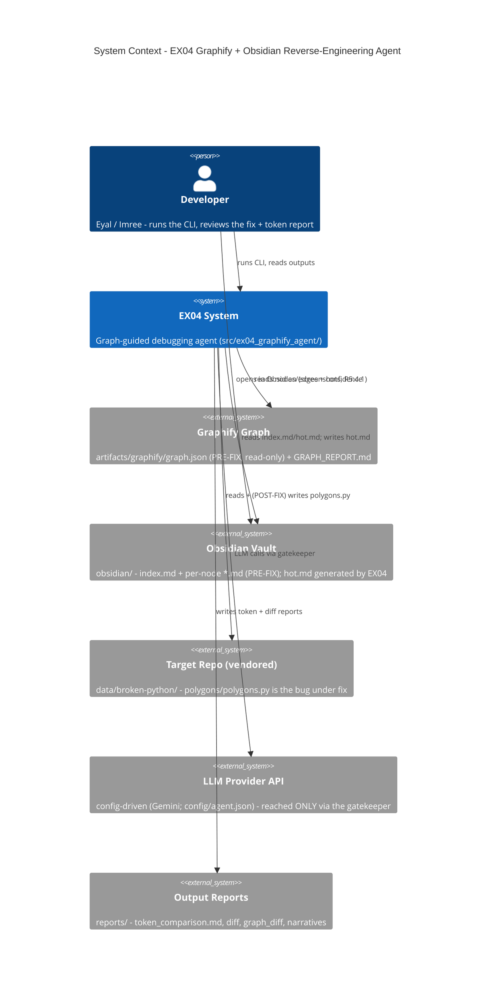
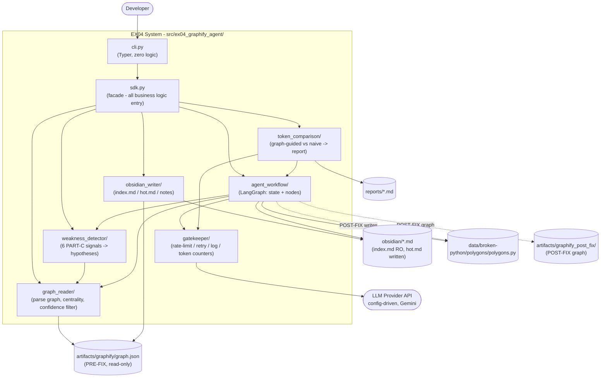
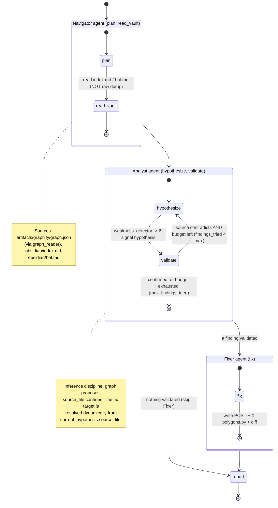
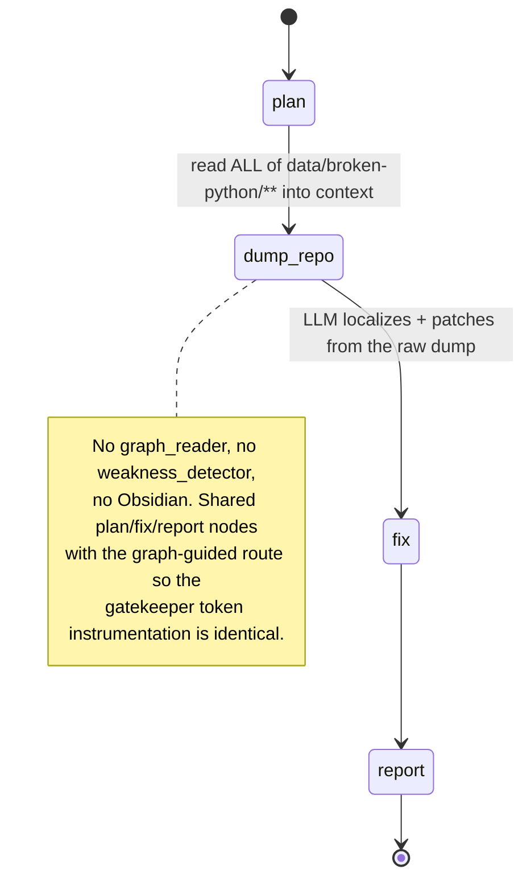
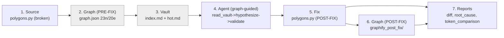

# Architecture & Workflow Diagrams (R5.4.2 / R7.3)

> Rendered as Mermaid (GitHub renders these inline — no binary toolchain, fully
> reproducible from this file). The two agent-workflow diagrams use the **actual compiled
> node names** from `agent_workflow/graph_def.py`, so they are verified against the real
> `build_graph` topology (PHASE7-005 — see "Topology verification" at the end).

## 1. C4 — System Context (R5.4.2)



## 2. C4 — Container (module) diagram



## 3. Agent workflow — graph-guided **three-agent crew** (`run_type = graph_guided`)

The route is an orchestrator over three specialist subgraphs (ADR-0006), wired in
`_wire_graph_guided` (`agent_workflow/graph_def.py`) from the agent builders in
`agent_workflow/agents.py`. The **Navigator** agent owns `plan → read_vault`; the **Analyst**
agent owns `hypothesize → validate` with the **conditional** bounded validate→hypothesize loop;
the **Fixer** agent owns `fix`. A deterministic post-Analyst gate runs the Fixer only when a
finding validated, else reports; the orchestrator owns `report`.



## 4. Agent workflow — naive baseline route (`run_type = naive`)

From `_wire_naive`: `plan → dump_repo → fix → report`. No `read_vault`, no `hypothesize`, no
`validate` — the "Lost in the Middle" baseline (R1.4 / ADR-0004).



## 5. End-to-end pipeline (R5.5.1) — repo → graph → vault → agent → fix



Each stage's inspectable artifact is tabulated in [`pipeline.md`](pipeline.md) (R5.5.2).

## Topology verification (PHASE7-005)

The graph-guided and naive diagrams above were checked against the compiled graph by
listing `agent_workflow.graph_def.node_names(run_type)` and the wired edges:

- **graph_guided:** `plan, read_vault, hypothesize, validate, fix, report` — the crew's nodes in
  execution order (derived from `agents.CREW`), composed as the Navigator → Analyst →
  (Fixer | report) subgraphs, with the bounded `validate → hypothesize` loop inside the Analyst
  and the `Analyst → {Fixer, report}` gate at the orchestrator (ADR-0006).
- **naive:** `plan, dump_repo, fix, report` (one flat monolithic agent — no crew).

Reproduce:

```bash
uv run python -c "from ex04_graphify_agent.agent_workflow.graph_def import node_names; \
print('graph_guided', node_names('graph_guided')); print('naive', node_names('naive'))"
```
